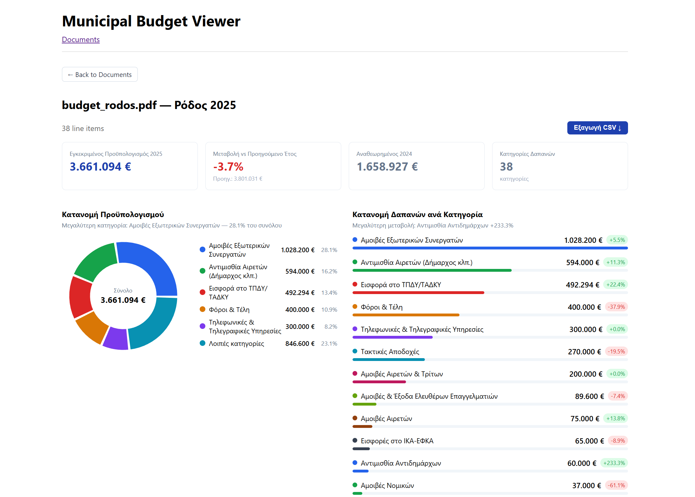

# Municipal Budget Visualization Tool

A proof-of-concept tool for extracting, storing, and visualizing Greek municipal budget documents published on [Diavgeia](https://diavgeia.gov.gr). Built as part of the [OpenCouncil](https://opencouncil.gr) Google Summer of Code project.

---



---

## Overview

Greek municipalities are legally required to publish their annual budgets and technical programs as PDF documents on Diavgeia, the national transparency portal. These documents are unstructured and vary in formatting across municipalities, making programmatic analysis difficult.

This tool automates the full pipeline: it discovers and downloads the relevant PDFs from Diavgeia, extracts structured data using an LLM, stores it in a relational database, and presents it through a web interface with filtering, hierarchy views, and charts.

Two document types are supported:

| Type | Greek name | Contents |
|---|---|---|
| `BUDGET` | Τεύχος Προϋπολογισμού Δαπανών | Hierarchical KAE expense codes with year-over-year amounts |
| `TECHNICAL_PROGRAM` | Τεχνικό Πρόγραμμα | Infrastructure project listings with approved and allocated amounts |

---

## Architecture

```
Diavgeia API
    │  discover PDFs by municipality + year
    ▼
PDF files
    │  pdfplumber → text chunks per page
    ▼
LLM (Claude Haiku or Ollama)
    │  structured JSON extraction
    ▼
ETL pipeline (Python)
    │  normalize → flat Item list
    ▼
PostgreSQL   ←──  Prisma schema
    │
    ▼
Next.js API routes  →  Next.js pages  →  Browser
```

The ETL pipeline connects to PostgreSQL via `psycopg2` directly. The web app uses Prisma Client. Both share the same `DATABASE_URL`.

---

## Requirements

- Docker Desktop
- Node.js 18+
- Python 3.11+
- An Anthropic API key (optional — falls back to a local Ollama model)

---

## Setup

### 1. Clone and start the database

```bash
git clone <repo-url>
cd municipal-budget-viz
docker compose up -d postgres
```

### 2. Web app

```bash
cd web
cp .env.example .env
npm install
npx prisma migrate deploy
npx prisma generate
npm run dev   # http://localhost:3000
```

### 3. ETL pipeline

```bash
cd etl
cp .env.example .env
pip install -r requirements.txt
```

Set `ANTHROPIC_API_KEY` in `etl/.env` to use Claude Haiku for extraction. Without it, the pipeline falls back to a local Ollama model (`qwen2.5:7b`).

### 4. Import documents

**Diavgeia discovery mode** — automatically finds and downloads PDFs for a municipality:

```bash
python pipeline.py --municipality "Αχαρνές" --year 2025
```

**Manual mode** — point at a local PDF:

```bash
python pipeline.py --input path/to/budget.pdf --type budget
python pipeline.py --input path/to/technical.pdf --type technical
```

`--type auto` (default) detects the document type from filename keywords and page content.

---

## Windows convenience scripts

From `municipal-budget-viz/`:

```powershell
.\run.ps1    # start Docker + Next.js dev server
.\stop.ps1   # stop everything
```

---

## Project structure

```
municipal-budget-viz/
├── docker-compose.yml
├── run.ps1 / run.sh
├── stop.ps1 / stop.sh
├── etl/
│   ├── pipeline.py                  # CLI entry point
│   ├── extractors/
│   │   ├── budget_extractor.py      # pdfplumber + LLM for BUDGET docs
│   │   ├── technical_extractor.py   # pdfplumber + LLM for TECHNICAL_PROGRAM docs
│   │   ├── claude_extractor.py      # Claude Haiku backend
│   │   ├── ollama_extractor.py      # Ollama backend (local fallback); defines prompts + validators
│   │   └── text_extractor.py        # pdfplumber page-text utility
│   ├── transformers/
│   │   └── amount_parser.py         # European number format parser (1.661.761,40 → Decimal)
│   ├── loaders/
│   │   └── db_loader.py             # psycopg2 loader; duplicate-safe
│   ├── discovery/
│   │   └── diavgeia_client.py       # Diavgeia REST API client
│   └── tests/                       # 55+ unit tests (pytest)
└── web/
    ├── prisma/schema.prisma          # DB schema
    ├── app/
    │   ├── page.tsx                  # Document list with municipality filter
    │   ├── document/[id]/page.tsx    # Unified detail page
    │   ├── components/
    │   │   ├── BudgetChart.tsx       # Pie chart (Recharts)
    │   │   └── YearChart.tsx         # Year-over-year bar chart
    │   └── api/
    │       ├── documents/route.ts
    │       ├── items/route.ts
    │       └── search/route.ts
    └── lib/db.ts                     # Prisma client singleton
```

---

## Database schema

```
Document
  id, filename, docType (BUDGET | TECHNICAL_PROGRAM),
  municipality, year, adaCode, importedAt
  └─ Item[]
       id, documentId, code, description, parentCode
       └─ ItemAmount[]
            id, itemId, label, amount (Decimal 15,2)
```

One schema serves both document types. For `BUDGET` documents, `parentCode` encodes the KAE hierarchy by code truncation — no separate hierarchy table is needed. For `TECHNICAL_PROGRAM` documents, `parentCode` is always `null`.

**KAE code levels (BUDGET only)**

```
"00"           → level 0 — section      (bold, shaded)
"00-60"        → level 1 — group        (bold)
"00-603"       → level 2 — article
"00-6031"      → level 3 — sub-item
"00-6031.0001" → level 4 — detail       (indented)
```

**Amount labels by document type**

| Document type | Labels stored per item |
|---|---|
| `BUDGET` | ΠΥ 2024, Αναμορφωμένος, ΠΥ 2025, Διαφορά |
| `TECHNICAL_PROGRAM` | Προϋπολογισμός, Ποσό |

---

## Web interface

| Route | Description |
|---|---|
| `/` | Document list with municipality filter, item count, and Diavgeia ADA links |
| `/document/[id]` | Detail view: KAE tree (budget) or flat list (technical), pie chart, year-over-year bar chart |
| `GET /api/documents` | JSON list of all documents |
| `GET /api/items?documentId=N` | All items with amounts for a document |
| `GET /api/search?q=...` | Full-text search across item descriptions |

Column headers on the detail page are derived dynamically from the `ItemAmount` labels present in the database, so both document types render correctly without special-casing in the frontend.

---

## Running the tests

```bash
cd etl
pytest tests/ -v
```

---

## Deployment (optional)

The Docker Compose file includes a `cloudflared` service for exposing the app via a Cloudflare Tunnel. Set the `TUNNEL_TOKEN` environment variable before starting:

```bash
TUNNEL_TOKEN=<your-token> docker compose up
```

---

## Known limitations

- Scanned (image-only) PDFs are not supported — pdfplumber requires selectable text.
- No pagination — all items for a document are fetched in a single query.
- No authentication.
- Cross-municipality comparison is not yet implemented.
- Re-running the ETL on the same PDF re-imports from scratch; duplicate detection prevents double-counting.
